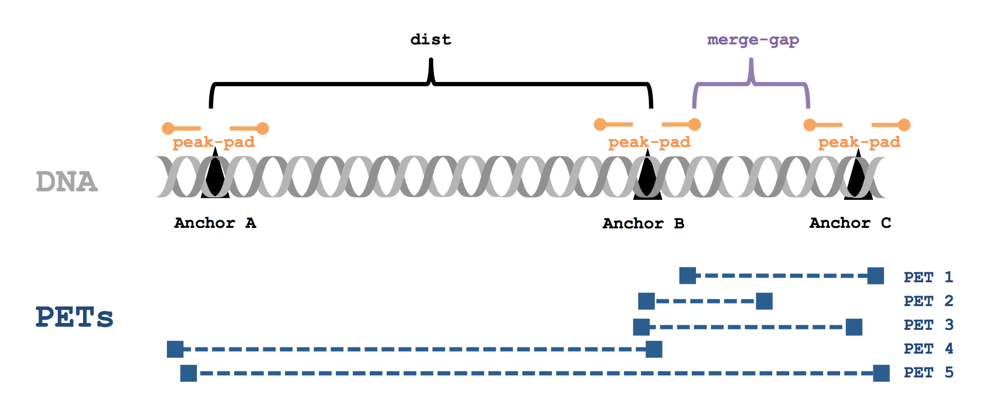

# hichipper
This package is maintained by [Caleb Lareau](caleblareau@g.harvard.edu) under the supervision of [Martin Aryee](http://aryee.mgh.harvard.edu/) and made freely available through [PyPi](https://pypi.python.org/pypi/hichipper/).

[](https://travis-ci.org/aryeelab/hichipper) [](https://badge.fury.io/py/hichipper) [](https://opensource.org/licenses/mit-license.php) 

## About<a name="about"></a>

The **hichipper** package implements our data processing and quality control pipeline for 
[HiChIP](http://www.nature.com/nmeth/journal/vaop/ncurrent/full/nmeth.3999.html) data.
This package takes aligned `.bam` files and a sample manifest file (`.yaml`) as input and produces output that can be used to 1) determine library quality, 2) identify and characterize DNA loops and 3) interactively visualize loops. Loops are assigned strength and confidence metrics that can be used to evaluate samples individually or for differential analysis in downstream tools like [diffloop](http://bioconductor.org/packages/release/bioc/html/diffloop.html). We have used the library QC metrics with as few as 1 million reads, enabling library quality to be assessed through shallow (and cheap) sequencing before performing a full depth sequencing run.

A graphical overview showing how **hichipper** integrates with other tools in the analysis of raw HiChIP data is shown in the overview figure below. Detailed descriptions of the different branches of output from **hichipper** are discussed at the bottom of this guide. 

<br>
A higher resolution [slide of this image](media/Big.pptx) is in the [media](media) folder.


## Table of Contents<a name="toc"></a>
- [About](#about)
- [Table of Contents](#toc)
- [Workflow Overview](#ugo)
- [Dependencies](#dependencies)
- [Installation](#installation)
- [Simple Usage Example](#sue)
- [More typical example](#moe)
- [Output](#output)
- [Configurations](#configuration)
- [Parameter Explanations](#pe)
- [Quality Control reports](#qcr)
- [Interactive visualization of loops](#viz)
- [Analyzing loops in the R](#loops)

## Workflow Overview<a name="ugo"></a>
A simple graphical guide to processing HiChIP data is shown below. The role of **hichipper**
is to import `.bam` files from alignment software (e.g. [HiC-Pro](https://github.com/nservant/HiC-Pro))
as well as a sample `.yaml` file and produce user-friendly output. 
 


## Dependencies<a name="dependencies"></a>

The following dependencies need to be manually installed and available in the PATH when executing **hichipper**. 
- [samtools](http://www.htslib.org/download/)
- [bedtools](http://bedtools.readthedocs.io/en/latest/content/installation.html)

Additionally, to produce a QC report, R must be available in the environment as well as these packages:
- dplyr
- foreach
- ggplot2
- gridExtra
- reshape2
- scales

These can all be installed (if needed) running these lines of code in the R console--

```
install_pkgs <- function(pkg){
    new.pkg <- pkg[!(pkg %in% installed.packages()[, "Package"])]
    if (length(new.pkg)) install.packages(new.pkg, dependencies = TRUE)
}
install_pkgs(c("dplyr", "foreach", "ggplot2", "gridExtra", "reshape2", "scales"))
```

Finally, to produce a `.rds` file for immediate visualization of loops in [DNAlandscapeR](https://dnalandscaper.aryeelab.org),
the `diffloop` package must be installed either from [Bioconductor](http://bioconductor.org/packages/release/bioc/html/diffloop.html) (for the stable release version) or [Github](https://github.com/aryeelab/hichipper) (for the most current version). Run the following commands in the R console to install `diffloop` from Github (if needed).  

```
install.packages("devtools") # if needed
devtools::install_github("aryeelab/diffloop")
```

## Installation<a name="installation"></a>

To install **hichipper** given the dependencies above, simply run:

```
pip install hichipper
```

## Simple usage example<a name="sue"></a>

The example below uses the test dataset bundled with the **hichipper** package source code. Download the package with:

```
git clone https://github.com/aryeelab/hichipper.git
```

1. Create a sample description file:
  
  Sample description files can be created with the `.yaml` format. 

  **Processing `.yaml` format**
   
   Example [yaml](https://en.wikipedia.org/wiki/YAML) format sample description file:
   
   ```
   samples:
      test_sample1: 
       - bam/t_1_hg19.bwt2merged.bam bam/t_2_hg19.bwt2merged.bam
      test_sample2:
       - bam/t_1_hg19.bwt2merged.bam bam/t_2_hg19.bwt2merged.bam
   ```
   
  In this example, the `test_sample1` sample is defined the `t_1_hg19.bwt2merged.bam` and `t_2_hg19.bwt2merged.bam` which
  where output files from [HiC-Pro](https://github.com/nservant/HiC-Pro). Any `.bam` files from Hi-C preprocessing
  software should be valid input. 
  
  
2. Run the pipeline:
	```
	hichipper --out output1 example.yaml
	```

## More typical example<a name="moe"></a>
While the example above references files that are part of the **hichipper** distribution,
our experience using this tool in conjunction with HiC-Pro suggests that a file hierarchy
like the following may be more typical. 

```
fastq/
|-- S75
|  |-- SRR3467175_1.fastq.gz
|  |-- SRR3467175_2.fastq.gz
|-- S76
|  |-- SRR3467176_1.fastq.gz
|  |-- SRR3467176_2.fastq.gz
|-- S77
|  |-- SRR3467177_1.fastq.gz
|  |-- SRR3467177_2.fastq.gz
|-- S78
|  |-- SRR3467178_1.fastq.gz
|  |-- SRR3467178_2.fastq.gz
hicpro_output/
|-- bowtie_results/
|  |-- bwt2/
|  |  |-- S75
|  |  |  |-- SRR3467175_1_hg19.bwt2merged.bam
|  |  |  |-- SRR3467175_2_hg19.bwt2merged.bam
|  |  |-- S76
|  |  |  |-- SRR3467176_1_hg19.bwt2merged.bam
|  |  |  |-- SRR3467176_2_hg19.bwt2merged.bam
|  |  |-- S77
|  |  |  |-- SRR3467177_1_hg19.bwt2merged.bam
|  |  |  |-- SRR3467177_2_hg19.bwt2merged.bam
|  |  |-- S78
|  |  |  |-- SRR3467178_1_hg19.bwt2merged.bam
|  |  |  |-- SRR3467178_2_hg19.bwt2merged.bam
config.yaml
config-hicpro-mboi-ext12.txt
```
The results in the `hicpro_output` directory could have been obtained by running: 
```
HiC-Pro -i fastq/ -o hicpro_output/ -c config-hicpro-mboi-ext12.txt -p
```
and subsequently executing the resulting `HiCPro_step1_hic.sh`.  Thus, the `config.yaml` file
when executed from the current working directory would look like this:

```
samples:
  S75:
    - hicpro_output/bowtie_results/bwt2/S75/SRR3467175_1_hg19.bwt2merged.bam hicpro_output/bowtie_results/bwt2/S75/SRR3467175_2_hg19.bwt2merged.bam
  S76:
    - hicpro_output/bowtie_results/bwt2/S76/SRR3467176_1_hg19.bwt2merged.bam hicpro_output/bowtie_results/bwt2/S76/SRR3467176_2_hg19.bwt2merged.bam
  S77:
    - hicpro_output/bowtie_results/bwt2/S77/SRR3467177_1_hg19.bwt2merged.bam hicpro_output/bowtie_results/bwt2/S77/SRR3467177_2_hg19.bwt2merged.bam
  S78:
    - hicpro_output/bowtie_results/bwt2/S78/SRR3467178_1_hg19.bwt2merged.bam hicpro_output/bowtie_results/bwt2/S78/SRR3467178_2_hg19.bwt2merged.bam
```

And could be executed running this command: 

```
hichipper --out GM12878 config.yaml
```

would yield the default output from **hichipper**. 

## Output<a name="output"></a>

### Per-run output files
Each time the user runs **hichipper**, a `*.hichipper.log` file containing information pertaining to the 
flow of the software execution is placed in the `out` directory (specified by the `--out` flag). Unless
otherwise specified, a file ending in `*_hichipper-qcReport.pdf` provides a summary quality control report for all samples. 

### Per-sample output files
Per sample, six (yes, 6, but don't worry-- there's lots of redundancy) output files are created. They are:

1. `*.stat` Key summary statistics that show the number of PETs meeting certain criteria

2. `*.inter.loop_counts.bedpe` Interchromosomal looping between anchor loci. 

3. `*.intra.loop_counts.bedpe` Intrachromosomal looping between **all**  anchor loci

4. `*.filt.intra.loop_counts.bedpe` Intrachromosomal looping between anchor loci where loops meet min/max distance requirements.

5. `*interactions.all.mango` The same set of loops as 4 but with per-loop FDR measures from the loop proximity bias correction algorithm originally implemented in [Mango](https://github.com/dphansti/mango) and presented in the same format. 

6. `*.rds` The same set of loops as 4 but in an R binary compressed format of a `loops()` S4 object from [diffloop](http://bioconductor.org/packages/release/bioc/html/diffloop.html). Can immediately be imported for interactie visualization in [DNAlandscapeR](https://dnalandscaper.aryeelab.org).

So, outputs 4, 5, and 6 are identical except in presentation. These data are a subset of those presented in 3. Interchromosomal interactions from 2 are often discarded by other preprocessing pipelines, but they may hold value. 
If the `qcReport` is generated, then the `.stat` file won't tell you anything new. However, if `R` is not installed on your machine, this will be a useful file for assessing the quality of your library.  

## Configurations<a name="configuration"></a>
Running
```
hichipper --help
```
shows the parameters that can be used in this software package as reproduced below.

```
Usage: hichipper [OPTIONS] MANIFEST

  A preprocessing and QC pipeline for HiChIP data.

Options:
  --out TEXT           Output directory name  [required]
  --min-dist TEXT      Minimum distance ; default = 5000
  --max-dist TEXT      Peak padding width (applied on both left and right);
                       default = 2000000
  --macs2-string TEXT  String of arguments to pass to MACS2; default = "-p
                       0.01 --nomodel"
  --peak-pad TEXT      Peak padding width (applied on both left and right);
                       default = 1500
  --merge-gap TEXT     Max gap size for merging peaks; default = 1500
  --min-qual TEXT      Minimum quality for read; default = 30
  --read-length TEXT   Length of reads from experiment; default = 75
  --keep-temp-files    Keep temporary files?
  --skip-qc            Skip QC report generation? (Requires R + dependent
                       packages (see README))
  --skip-diffloop      Skip diffloop processing of loops? (Requires R +
                       [diffloop](http://bioconductor.org/packages/release/bioc/html/diffloop.html))
  --version            Show the version and exit.
  --help               Show this message and exit.
```
 
Running
```
hichipper --version
```  
will show the version of this package currently installed. 

```
hichipper, version X.X.X
```
Check the badge up top to see if a newer version is available or try directly through `pip`:

```
pip install hichipper --upgrate
```

Unless these flags are supplied, the pipeline will attempt to run. Minimally sufficient parameters include
the `--out` flag and a `.yaml` file as shown in the example executions. Below are some explanations of the
additional parameters than can be configured when executing the pipeline. 

## Parameter explanations<a name="pe"></a>



The `--merge-gap` command is basically just running [bedtools merge -d](http://bedtools.readthedocs.io/en/latest/content/tools/merge.html) on the padded anchors. 

## Quality Control reports
Show two histrograms, make references, mention to send interesting reports for further collection (will be anon. unless made public). 

## Finding differences<a name="loops"></a>
Have you generated a bunch of HiChIP samples and want to see what's different between them? Check out
the [diffloop vignette](http://rpubs.com/caleblareau/diffloop_vignette) for an example analysis
comparing loops from ChIA-PET (the cranky uncle of HiChIP) between K562 and MCF-7. Installation
instructions for this package are shown in the [dependencies](#dependencies) section. 

## Interactive visualization of loops<a name="viz"></a>
One you've (hopefully) assessed that your samples look good, now go visualize them! One option
is to link the `.bedpe` file to the [WashU Genome Browser](http://epigenomegateway.wustl.edu/). Another
option is to upload the `.rds` to our genome topology browser, [DNAlandscapeR](https://dnalandscaper.aryeelab.org). Navigate
to the **Guide** tab to get a sense of how the browser works and ultimately add your sample(s) to a local user session
using the **Import** tab. Note: the browser currently supports hg19/hg37 and mm9 genome builds. 

## Questions/comments/feedback
are always welcomed. Email [Caleb](caleblareau@g.harvard.edu) anytime! 
