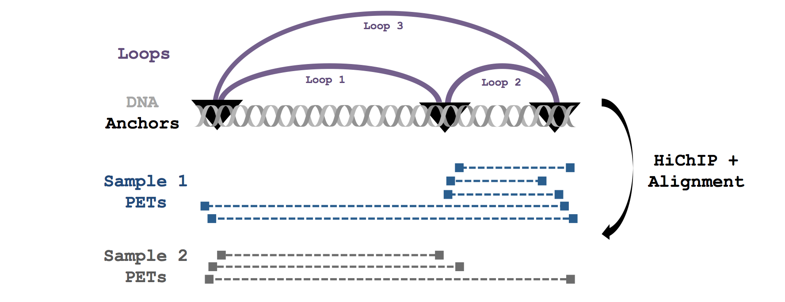
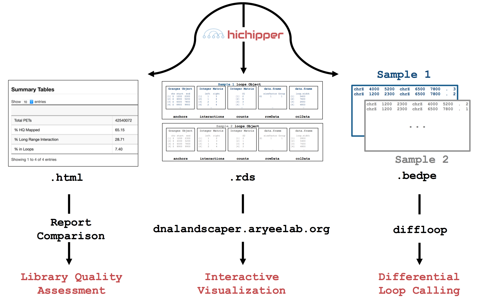

     
  

This package is maintained by [Caleb Lareau](mailto:caleblareau@g.harvard.edu) in
the [Aryee Lab](http://aryee.mgh.harvard.edu/). Source code is made freely available
here and a packaged install version is provided through [PyPi](https://pypi.python.org/pypi/hichipper/).

## About
The **hichipper** package implements our data processing and quality control pipeline for 
[HiChIP](http://www.nature.com/nmeth/journal/vaop/ncurrent/full/nmeth.3999.html) data.
This package takes output from a [HiC-Pro](https://github.com/nservant/HiC-Pro)
run and a sample manifest file (`.yaml`)
that coordinates optional high-quality peaks (identified through ChIP-Seq) and
restriction fragment locations (see [folder here](RestrictionFragmentFiles))
as input and produces output that can be used to 1) determine library quality,
2) identify and characterize DNA loops and 3) interactively visualize loops.
Loops are assigned strength and confidence metrics that can be used to evaluate samples
individually or for differential analysis in
downstream tools like [diffloop](https://bioconductor.org/packages/release/bioc/html/diffloop.html).

We have used the library QC metrics with as few as 1 million reads, enabling library quality
to be assessed through shallow (and cheap) sequencing before performing a full depth sequencing run.

A graphical overview showing how **hichipper** integrates with other tools in the analysis of raw HiChIP data
is shown in the overview figure below. Detailed descriptions of the different branches of
input, output, and configuration for **hichipper** are discussed in the [documentation](http://hichipper.readthedocs.io).

 

## Installation/Documentation/FAQ/.etc

Check out the [**hichipper** documentation](http://hichipper.readthedocs.io) for detailed
installation instructions, dependency configuration, and other information regarding the tool and its implementation.
  

## Workflow Overview
A simple graphical guide to processing HiChIP data is shown below. The role of **hichipper**
is to import aligned read files from (e.g. [HiC-Pro](https://github.com/nservant/HiC-Pro))
as well as location of restriction fragment files
([available here](https://github.com/aryeelab/hichipper/tree/master/RestrictionFragmentFiles)) coordinated through a
`.yaml` configuration file and produce user-friendly output. 

In particular, **hichipper** allows users to pre-supply their own set of gold-standard peaks (e.g. from ChIP-Seq)
or call peaks directly from HiChIP data using a novel background detection algorithm. In either case, interactions
and chromatin loops can be called using a restriction fragment-aware approach that substantially increases read density in loops. 
 

## Quality control reports
In the [qcReports folder](qcReports), we collect the `.html` QC report files associated with text annotations
from the experiments performed in the [original HiChIP manuscript](http://www.nature.com/nmeth/journal/vaop/ncurrent/full/nmeth.3999.html)
as well as other reports generated by anonymous collaborators that demonstrate libraries that did not prepare well, likely due
to poor in situ ligation. To determine the quality of a new HiChIP library, we recommend comparing the vital statistics and 
interactive tables and figures between existing libraries. 

### Citation
If you use **hichipper** for your work, please cite:

Lareau, C.A. and Aryee, M.J. (2017) "hichipper: A preprocessing pipeline for assessing library quality and DNA loops from HiChIP data." _bioRxiv_ [doi: https://doi.org/10.1101/192302 ](https://www.biorxiv.org/content/early/2017/09/21/192302)

### Questions/comments/feedback
are always welcomed. The easiest way for us to have correspondence (if appropriate/interesting
for the public) is through raising a [new issue](https://github.com/aryeelab/hichipper/issues/new) or our [hichipper chat room on gitter](https://gitter.im/aryeelab/hichipper).
Otherwise, email [Caleb](mailto:caleblareau@g.harvard.edu) with any private concerns.
  
**hichipper** logo made with [autowide font](http://www.1001freefonts.com/audiowide.font) with these
[blue](http://www.color-hex.com/color/4b96c6) and [red](http://www.color-hex.com/color/bf5150)
color definitions.
  
