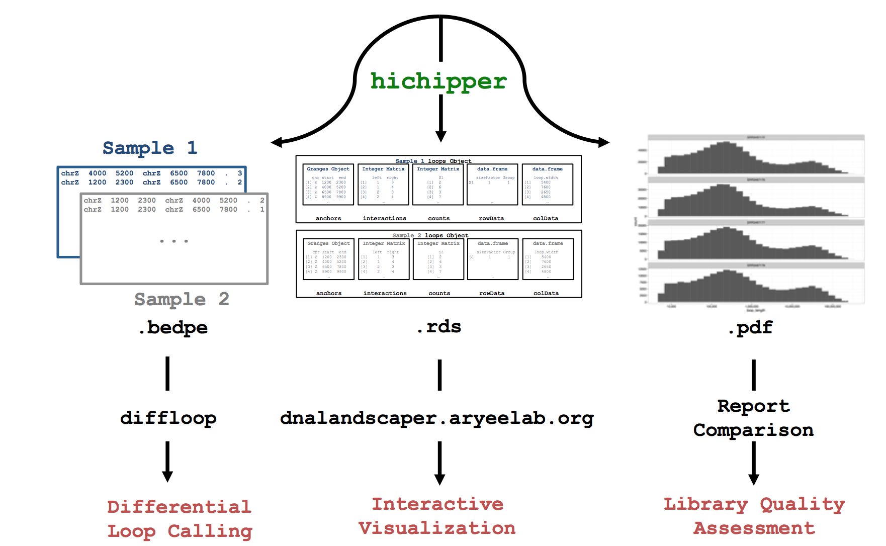
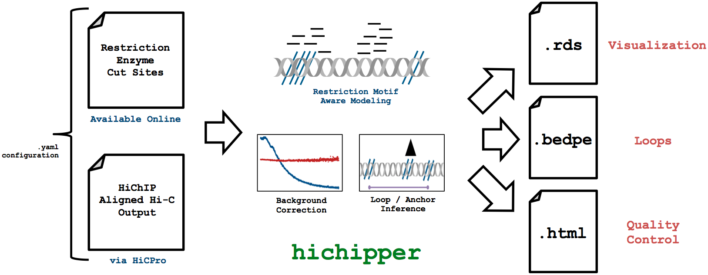
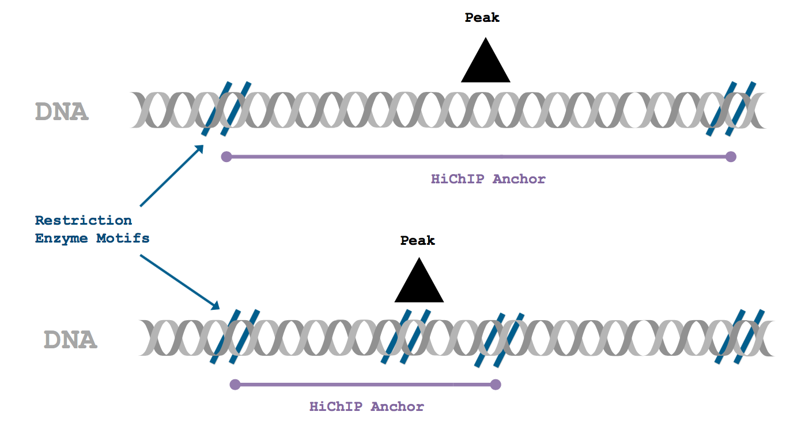

# hichipper
This package is maintained by [Caleb Lareau](mailto:caleblareau@g.harvard.edu) in the [Aryee Lab](http://aryee.mgh.harvard.edu/). Source code is made freely available here and a packaged install version is provided through [PyPi](https://pypi.python.org/pypi/hichipper/).

[](https://travis-ci.org/aryeelab/hichipper) [](https://img.shields.io/badge/pypi-0.5.3-brightgreen.svg) [](https://opensource.org/licenses/mit-license.php) 

## About<a name="about"></a>

The **hichipper** package implements our data processing and quality control pipeline for 
[HiChIP](http://www.nature.com/nmeth/journal/vaop/ncurrent/full/nmeth.3999.html) data.
This package takes output from a [HiC-Pro](https://github.com/nservant/HiC-Pro) run and a sample manifest file (`.yaml`) that coordinates optional high-quality peaks (identified through ChIP-Seq) and restriction fragment locations (see [folder here](RestrictionFragmentFiles))
as input and produces output that can be used to 1) determine library quality, 2) identify and characterize DNA loops and 3) interactively visualize loops. Loops are assigned strength and confidence metrics that can be used to evaluate samples individually or for differential analysis in
downstream tools like [diffloop](http://github.com/aryeelab/diffloop).
We have used the library QC metrics with as few as 1 million reads, enabling library quality to be assessed through shallow (and cheap) sequencing before performing a full depth sequencing run.

A graphical overview showing how **hichipper** integrates with other tools in the analysis of raw HiChIP data is shown in the overview figure below. Detailed descriptions of the different branches of output from **hichipper** are discussed at the bottom of this guide. 

<br>
A higher resolution [slide of this image](media/Big.pptx) is in the [media](media) folder.


## Table of Contents<a name="toc"></a>
- [About](#about)
- [Table of Contents](#toc)
- [Workflow Overview](#ugo)
- [Dependencies](#dependencies)
- [Installation](#installation)
- [Simple Usage Example](#sue)
- [More typical example](#moe)
- [Output](#output)
- [Peaks](#HPC)
- [Configurations](#configuration)
- [Restriction-fragment aware padding](#rfap)
- [Parameter Explanations](#pe)
- [User parameter recommendations](#ur)
- [Quality Control reports](#qcr)
- [Interactive visualization of loops](#viz)
- [Visualization in UCSC](#vizUCSC)
- [Analyzing loops in the R](#loops)

## Workflow Overview<a name="ugo"></a>
A simple graphical guide to processing HiChIP data is shown below. The role of **hichipper**
is to import aligned read files from (e.g. [HiC-Pro](https://github.com/nservant/HiC-Pro))
as well as location of restriction fragment files
([available here](https://github.com/aryeelab/hichipper/tree/master/RestrictionFragmentFiles)) coordinated through a
`.yaml` configuration file and produce user-friendly output. 

In particular, **hichipper** allows users to pre-supply their own set of gold-standard peaks (e.g. from ChIP-Seq)
or call peaks directly from HiChIP data using a novel background detection algorithm. In either case, interactions
and chromatin loops can be called using a restriction fragment-aware approach that substantially increases read density in loops. 
 


A higher resolution [slide of this image](media/Overview.pptx) is in the [media](media) folder.

## Dependencies<a name="dependencies"></a>

The following dependencies need to be installed before running **hichipper**: [bedtools](http://bedtools.readthedocs.io/en/latest/content/installation.html), OpenSSL, libcurl, and libxml2.
Except for `bedtools`, these other dependencies came out of the box with the unix/linux systems that we've used **hichipper** on. 

But just to be safe, on an Ubuntu system, all of the dependencies can be installed with:
```
apt-get install bedtools libssl-dev libcurl4-openssl-dev libxml2-dev
```

Additionally, `R` must be available in the environment as well as a reasonably recent version of [pandoc](http://pandoc.org) and a few packages that can be downloaded running the following in an 'R' environment. :

```
install_pkgs <- function(pkg){
    new.pkg <- pkg[!(pkg %in% installed.packages()[, "Package"])]
    if (length(new.pkg)) install.packages(new.pkg, dependencies = TRUE)
}
install_pkgs(c("DT", "data.table", "devtools", "foreach", "ggplot2", "knitr", "networkD3", "readr", "reshape2"))

source("https://bioconductor.org/biocLite.R")
install_pkgs_bioc <- function(pkg){
    new.pkg <- pkg[!(pkg %in% installed.packages()[, "Package"])]
    if (length(new.pkg)) biocLite(new.pkg, dependencies = TRUE)
}
install_pkgs_bioc(c("diffloop"))
```

or simply download [this R script](hichipper/requirementsInstall.R) and run:
```
Rscript requirementsInstall.R
```

Convenient [pandoc binaries](https://s3.amazonaws.com/rstudio-buildtools/pandoc-1.12.4.2.zip) for Linux, Mac and Windows are available for download from RStudio. If you prefer to install pandoc globally on your machine, installation instructions can be found [here](http://pandoc.org/installing.html).

## Installation<a name="installation"></a>

To install **hichipper** given the dependencies above globally on your machine, simply run:

```
pip install hichipper
```

We've found success using a virtual python 2.7 environment when installing **hichipper**. A crash course of the commands required 
is shown below. A more robust and informative discussion of virtual environments in python can be found [here](http://docs.python-guide.org/en/latest/dev/virtualenvs/).

```
virtualenv venv
source venv/bin/activate
pip install hichipper
hichipper --version
```


## Simple usage example<a name="sue"></a>

The example below uses the test dataset bundled with the **hichipper** package source code. Download the package, change to the test directory, and execute the basic working example with:

```
git clone https://github.com/aryeelab/hichipper.git
cd hichipper/tests
hichipper --out output1 yaml/one.yaml 
```

Here's a more detailed description of what just happened. First, we had to create a sample description file that specifies how peaks are to be inferred (in this example, they are pre-specified from a ChIP-Seq experiment). 
Next, one must specify the location of a restriction fragment file. Finally, a path to the HiC-Pro output folder must be designated. These are encoded
through the `peaks`, `resfrags`, and `hicpro_output` variables that will be parsed from the `.yaml` format. 

1. Create a sample description file:
  
  Description files can be created with the `.yaml` format. 

  **Processing `.yaml` format**
   
   Example [yaml](https://en.wikipedia.org/wiki/YAML) format sample description file:
   
   ```
   peaks:
    - chipseq/GM12878_SMC3_ChIPSeq_chr22.narrowPeak
   resfrags:
    - resfrag/hg19_MboI_resfrag_chr22.bed.gz
   hicpro_output:
    - hicpro
   ```
   
  Note: This file is available as `example.yaml` in the `hichipper/tests` directory.
  
  In this example, we call loops from two GM12878 samples using just chromosome 22 using pre-determined peaks from a ChIP-Seq file.   
  
  
2. Run the pipeline:

	```
	hichipper --out output1 yaml/one.yaml 
	```

Additional 

## More typical example<a name="moe"></a>
While the example above references files that are part of the **hichipper** distribution,
our experience using this tool in conjunction with HiC-Pro suggests that a file hierarchy
like the following may be more typical. 

```
ls -LR
```
yields (a slightly modified version of)
```
./hicpro/bowtie_results:
bwt2  bwt2_global  bwt2_local

./hicpro/bowtie_results/bwt2:
SRR3467175  SRR3467176  SRR3467177  SRR3467178

./hicpro/bowtie_results/bwt2/SRR3467175:
SRR3467175_1_hg19.bwt2merged.bam  SRR3467175_2_hg19.bwt2merged.bam  SRR3467175_hg19.bwt2pairs.bam
SRR3467175_1_hg19.mapstat         SRR3467175_2_hg19.mapstat         SRR3467175_hg19.bwt2pairs.pairstat*

./hicpro/bowtie_results/bwt2/SRR3467176:
SRR3467176_1_hg19.bwt2merged.bam  SRR3467176_2_hg19.bwt2merged.bam  SRR3467176_hg19.bwt2pairs.bam
SRR3467176_1_hg19.mapstat         SRR3467176_2_hg19.mapstat         SRR3467176_hg19.bwt2pairs.pairstat*

./hicpro/bowtie_results/bwt2/SRR3467177:
SRR3467177_1_hg19.bwt2merged.bam  SRR3467177_2_hg19.bwt2merged.bam  SRR3467177_hg19.bwt2pairs.bam
SRR3467177_1_hg19.mapstat         SRR3467177_2_hg19.mapstat         SRR3467177_hg19.bwt2pairs.pairstat*

./hicpro/bowtie_results/bwt2/SRR3467178:
SRR3467178_1_hg19.bwt2merged.bam  SRR3467178_2_hg19.bwt2merged.bam  SRR3467178_hg19.bwt2pairs.bam
SRR3467178_1_hg19.mapstat         SRR3467178_2_hg19.mapstat         SRR3467178_hg19.bwt2pairs.pairstat*

./hicpro/hic_results:
data

./hicpro/hic_results/data:
SRR3467175  SRR3467176  SRR3467177  SRR3467178

./hicpro/hic_results/data/SRR3467175:
SRR3467175_hg19.bwt2pairs.DEPairs*    SRR3467175_hg19.bwt2pairs.RSstat*   SRR3467175_hg19.bwt2pairs.SinglePairs*
SRR3467175_hg19.bwt2pairs.DumpPairs*  SRR3467175_hg19.bwt2pairs.SCPairs*  SRR3467175_hg19.bwt2pairs.validPairs*

./hicpro/hic_results/data/SRR3467176:
SRR3467176_hg19.bwt2pairs.DEPairs*    SRR3467176_hg19.bwt2pairs.RSstat*   SRR3467176_hg19.bwt2pairs.SinglePairs*
SRR3467176_hg19.bwt2pairs.DumpPairs*  SRR3467176_hg19.bwt2pairs.SCPairs*  SRR3467176_hg19.bwt2pairs.validPairs*

./hicpro/hic_results/data/SRR3467177:
SRR3467177_hg19.bwt2pairs.DEPairs*    SRR3467177_hg19.bwt2pairs.RSstat*   SRR3467177_hg19.bwt2pairs.SinglePairs*
SRR3467177_hg19.bwt2pairs.DumpPairs*  SRR3467177_hg19.bwt2pairs.SCPairs*  SRR3467177_hg19.bwt2pairs.validPairs*

./hicpro/hic_results/data/SRR3467178:
SRR3467178_hg19.bwt2pairs.DEPairs*    SRR3467178_hg19.bwt2pairs.RSstat*   SRR3467178_hg19.bwt2pairs.SinglePairs*
SRR3467178_hg19.bwt2pairs.DumpPairs*  SRR3467178_hg19.bwt2pairs.SCPairs*  SRR3467178_hg19.bwt2pairs.validPairs*

...

```
where files denoted in with an asterisk* are assumed to exist. Typically, an analysis folder may look like so:

```
fastq/
|-- SRR3467175
|  |-- SRR3467175_1.fastq.gz
|  |-- SRR3467175_2.fastq.gz
|-- SRR3467176
|  |-- SRR3467176_1.fastq.gz
|  |-- SRR3467176_2.fastq.gz
|-- SRR3467177
|  |-- SRR3467177_1.fastq.gz
|  |-- SRR3467177_2.fastq.gz
|-- SRR3467178
|  |-- SRR3467178_1.fastq.gz
|  |-- SRR3467178_2.fastq.gz
hicpro/
|-- HiCPro_step1_hic.sh
|-- bowtie_results/
|  |-- bwt2/
|  |  |-- SRR3467175
|  |  |  |-- SRR3467175_hg19.bwt2pairs.pairstat
|  |  |-- SRR3467176
|  |  |  |-- SRR3467176_hg19.bwt2pairs.pairstat
|  |  |-- SRR3467177
|  |  |  |-- SRR3467177_hg19.bwt2pairs.pairstat
|  |  |-- SRR3467178
|  |  |  |-- SRR3467178_hg19.bwt2pairs.pairstat
|-- hic_results/
|  |-- data/
|  |  |-- SRR3467175
|  |  |  |-- SRR3467175*RSstat
|  |  |  |-- SRR3467175*Pairs # 5 Files
|  |  |-- SRR3467176
|  |  |  |-- SRR3467176*RSstat
|  |  |  |-- SRR3467176*Pairs # 5 Files
|  |  |-- SRR3467177
|  |  |  |-- SRR3467177*RSstat
|  |  |  |-- SRR3467177*Pairs # 5 Files
|  |  |-- SRR3467178
|  |  |  |-- SRR3467178*RSstat
|  |  |  |-- SRR3467178*Pairs # 5 Files
GM12878_SMC3_ChIPSeq.narrowPeak
hg19_MboI_resfrag.bed.gz
yaml/
|-- one.yaml
config-hicpro-mboi-ext12.txt
```
where the results in the `hicpro` directory could have been obtained by running: 
```
HiC-Pro -i fastq/ -o hicpro/ -c config-hicpro-mboi-ext12.txt -p
```
and subsequently executing the resulting `HiCPro_step1_hic.sh`.  Thus, the `yaml/one.yaml` file
needed for **hichipper** when executed from the current working directory would look like this:

```
peaks:
  - GM12878_SMC3_ChIPSeq.narrowPeak
resfrags:
  - hg19_MboI_resfrag.bed.gz
hicpro_output:
  - hicpro
```

And could be executed running this command: 

```
hichipper --out GM12878 config.yaml
```

would yield the default output from **hichipper**. 

### Split .fastq files as input to HiC-Pro

As of version `0.5.3` of **hichipper**, users should be able to input split `.fastq` files into HiC-Pro
and have **hichipper** function properly. No extra user flags are needed for this functionality. Thanks
to our early users for helping us figure this out. 

## Output<a name="output"></a>

### Per-run output files
Each time the user runs **hichipper**, a `*.hichipper.log` file containing information pertaining to the 
flow of the software execution is placed in the `out` directory (specified by the `--out` flag). Unless
otherwise specified, a file ending in `hichipper-qcReport.html` provides an interactive quality control report for all samples. 

### Per-sample output files
Per sample, six (yes, 6, but don't worry-- there's lots of redundancy) output files are created. They are:

1. `*.stat` Key summary statistics that show the number of PETs meeting certain criteria

2. `*.inter.loop_counts.bedpe` Interchromosomal looping between anchor loci. 

3. `*.intra.loop_counts.bedpe` Intrachromosomal looping between **all**  anchor loci

4. `*.filt.intra.loop_counts.bedpe` Intrachromosomal looping between anchor loci where loops meet min/max distance requirements.

5. `*interactions.all.mango` The same set of loops as 4 but with per-loop FDR measures from the loop proximity bias correction algorithm originally implemented in [Mango](https://github.com/dphansti/mango) and presented in the same format. 

6. `*.rds` The same set of loops as 4 but in an R binary compressed format of a `loops()` S4 object from [diffloop](http://bioconductor.org/packages/release/bioc/html/diffloop.html). Can
immediately be imported for interactive visualization in [DNAlandscapeR](https://dnalandscaper.aryeelab.org).

So, outputs 4, 5, and 6 are identical except in presentation. These data are a subset of those presented in 3. Interchromosomal interactions from 2 are often discarded by other preprocessing pipelines, but they may hold value. 
If the `qcReport` is generated, then the `.stat` file won't tell you anything new. However, if `R` is not installed on your machine, this will be a useful file for assessing the quality of your library.  

## Peaks <a name="HPC"></a>

To call peaks from HiChIP data directly, **hichipper** aggregates read density from either all samples or each sample individually. Additionally,
users can specify whether all read density is used or if only self-ligation reads are used. To specify these options, put the appropriate 
string of the form `{COMBINED,EACH},{ALL,SELF}` in the `peaks` slot of the `.yaml`.

For example, to replicate the peak calling performed in Mumbach *et al.*, one would use the following `.yaml`: 

```
peaks:
  - COMBINED,SELF
resfrags:
  - hg19_MboI_resfrag.bed.gz
hicpro_output:
  - hicpro
```

Alternatively, we can call peaks from the HiChIP data for each sample individually using all reads using this specification--

```
peaks:
  - EACH,ALL
resfrags:
  - hg19_MboI_resfrag.bed.gz
hicpro_output:
  - hicpro
```

The figure below shows all options for peak specification in **hichipper** including every option
for inferring peaks which are noted in the table.


Alternatively, users can pre-specify a set of peaks to used. In this case, a "connectome" will be inferred between the peaks
specified in the `.bed` file. Of note, pre-specified peaks will still be padded either by fixed amounts or to the edges of the restriction 
fragment pads (or both) unless the user specifies these flags differently (see below). 

```
peaks:
  - predeterminedPeaks.bed
resfrags:
  - hg19_MboI_resfrag.bed.gz
hicpro_output:
  - hicpro
```

Note: the input of pre-determined peaks does not have to explicitly be a `.bed` file. Rather, any file name is acceptable so long
as the first three columns indicate appropriate genomic loci as if it were a `.bed` file. For example, `.narrowPeak` files from 
macs2 should be fine. 

## Configurations<a name="configuration"></a>
Running
```
hichipper --help
```
shows the parameters that can be used in this software package as reproduced below.

```
Usage: hichipper [OPTIONS] MANIFEST

  A preprocessing and QC pipeline for HiChIP data.

Options:
  --out TEXT                    Output directory name; must not be an already existing directory [Required]
  --min-dist TEXT               Minimum distance; default = 5000
  --max-dist TEXT               Peak padding width (applied on both left and
                                right); default = 2000000
  --macs2-string TEXT           String of arguments to pass to MACS2; only is
                                called when peaks are set to be called;
                                default = "-q 0.01 --extsize 147 --nomodel"
  --macs2-genome TEXT           Argument to pass to the -g variable in MACS2
                                (mm for mouse genome; hs for human genome);
                                default = "hs"
  --peak-pad TEXT               Peak padding width (applied on both left and
                                right); default = 500
  --merge-gap TEXT              Merge nearby peaks (after all padding is
                                complete); default = 500
  --keep-temp-files             Keep temporary files?
  --skip-background-correction  Skip restriction fragment aware background
                                correction?
  --skip-resfrag-pad            Skip restriction fragment aware padding
  --skip-qc                     Skip QC report generation?
  --skip-diffloop               Skip analyses in diffloop (e.g. Mango loop
                                calling; .rds generation)
  --make-ucsc                   Make additional output files that can support
                                viewing in UCSC genome browser; requires tabix
                                and htslib tools.
  --keep-samples TEXT           Comma separated list of sample names to keep;
                                ALL (special string) by default
  --ignore-samples TEXT         Comma separated list of sample names to
                                ignore; NONE (special string) by default
  --read-length TEXT            Length of reads from sequencing runs; default = 75
  --version                     Show the version and exit.
  --help                        Show this message and exit.
```
 
Running
```
hichipper --version
```  
will show the version of this package currently installed. 

```
hichipper, version 0.5.3
```
Check the badge up top to see if a newer version is available or try directly through `pip`:

```
pip install hichipper --upgrade
```

Unless these flags are supplied, the pipeline will attempt to run. Minimally sufficient parameters include
the `--out` flag and a `.yaml` file as shown in the example executions. Below are some explanations of the
additional parameters than can be configured when executing the pipeline. 

## Restriction-fragment aware padding<a name="rfap"></a>


## Parameter explanations<a name="pe"></a>

Most of the parameter options are fairly straight forward. Running `hichipper --version` or `hichipper --help`
doesn't run the tool but supplies the information noted above. Otherwise, the default run mode requires 
a `.yaml` file supplied in addition to the `--out` parameter, which specifies the output directory of the run. 
Users can decide to customize final output by using boolean flags or supply variable text input. The following 
cartoon shows a graphical overview of important parameters to consider when running **hichipper**.


As noted in orange, defined peaks are automatically padded by some integer width from the `--peak-pad` flag. By default, 
this pad extends 1500 base pairs in either direction. Padding the peaks boosts the number of PETs that can be mapped to loops. 
For example, `PET 1` would not be considered in loop since the left end of the read does not overlap with the called anchor. However,
it does overlap with the padded peak, so it is retained. When two peaks are close to one another, they may be merged using the 
`--merge-gap` command. As noted in purple, the padded peaks `B` and `C` are sufficiently close to be merged into a single anchor. 
Note that this can lead to some PETs becoming self-ligation (e.g. `1` and `3`). Note, the `--merge-gap` command is equivalent to running 
[bedtools merge -d](http://bedtools.readthedocs.io/en/latest/content/tools/merge.html) on the padded anchors. 

We compared various parameter settings [for the same sample here](https://cdn.rawgit.com/aryeelab/hichipper/master/qcReports/Parameters/peakPlay.hichipper.html).
Each sample was processed with a peak pad and merge gap of 250, 500, 1000, and 1500. By default, we've set these parameters at 1500 to mirror those established in
ChIA-PET preprocessing. However, the strong retention of reads near the called anchor loci suggest that using smaller parameter values (i.e. 250 or 500 bp) may be
optimal for HiChIP analyses to maximize resolution of loop contact loci. 

The `dist` or distance between two peaks is noted in black as the center of two peaks. The `--min-dist` flag is the smallest
and `--max-dist` is the largest integer number that ensures this distance falls between to be considered in a loop. These defaults
are 5Kb and 2Mb as smaller reads are likely self-ligations whereas larger reads are unlikely to be biologically real loops.

Finally, the `--macs2-string` allows users to directly configure the `macs2` call when defining anchors. By default, we use
use a model-free call. 

## User parameter recommendations<a name="ur"></a>
- If `R` is not in the system or if the `R` package dependencies could not be installed, the following flags should be added:
```
--skip-resfrag-pad --skip-diffloop --skip-qc --skip-background-correction
```
- In the current version of **hichipper**, the novel background correction implementation is quite memory intense. Thus, _users running **hichipper** on a laptop
or other low RAM machine_ should likely skip the adaptive background correction. 
```
--skip-background-correction
```

## Quality control reports
In the [qcReports folder](qcReports), we collect the `.html` QC report files associated with text annotations
from the experiments performed in the [original HiChIP manuscript](http://www.nature.com/nmeth/journal/vaop/ncurrent/full/nmeth.3999.html)
as well as other reports generated by anonymous collaborators that demonstrate libraries that did not prepare well, likely due
to poor in situ ligation. To determine the quality of a new HiChIP library, we recommend comparing the vital statistics and 
interactive tables and figures between existing libraries. 

## Finding differences<a name="loops"></a>
Have you generated a bunch of HiChIP samples and want to see what's different between them? Check out
the [diffloop vignette](https://rpubs.com/caleblareau/diffloop_vignette) for an example analysis
comparing loops from ChIA-PET (a similar 3C method to HiChIP) between K562 and MCF-7. Installation
instructions for this package are shown in the [dependencies](#dependencies) section. 

## Interactive visualization of loops<a name="viz"></a>
One you've (hopefully) assessed that your samples look good, now go visualize them! One option
is to link the `.bedpe` file to the [WashU Genome Browser](http://epigenomegateway.wustl.edu/). Another
option is to upload the `.rds` to our genome topology browser, [DNAlandscapeR](http://dnalandscaper.aryeelab.org). Navigate
to the **Guide** tab to get a sense of how the browser works and ultimately add your sample(s) to a local user session
using the **Import** tab. Note: the browser currently supports hg19/hg37 and mm9 genome builds. 

## Visualization in UCSC<a name="vizUCSC"></a>
Users can specify the `--make-ucsc` flag to produce output that can be imported into UCSC.
See [this discussion](https://groups.google.com/a/soe.ucsc.edu/forum/#!topic/genome/kE2pIZUvfnA) for an overview of the format.
In order to produce this output, **hichipper** needs access to the [htslib](http://www.htslib.org/download/) suite of tools
in the computational environment. You can see if you have these dependences available (namely, `tabix` and `bgzip`) by making
sure the following works:

```
tabix --version
```

Specifying this flag will create the additional files `*.txt.gz` and `.txt.gz.tbi`, which can be used to make a UCSC track. 
(Shout out to Gary for helping us with this!)

## Questions/comments/feedback
are always welcomed. Email [Caleb](mailto:caleblareau@g.harvard.edu) anytime! The easiest way for us to have correspondence (if appropriate/interesting
for the public) is through raising a [new issue](https://github.com/aryeelab/hichipper/issues/new).
