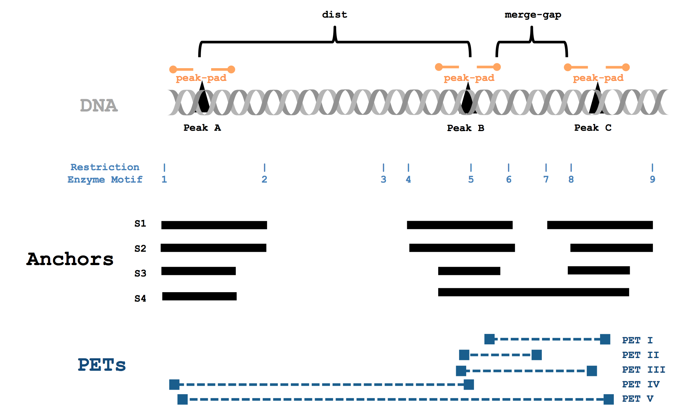

# hichipper parameters 

Running
```
hichipper --help
```
shows the parameters that can be used in this software package as reproduced below.

```
Usage: hichipper [OPTIONS] MANIFEST

  A preprocessing and QC pipeline for HiChIP data.

Options:
  --out TEXT                    Output directory name; must not be an already existing directory [Required]
  --min-dist TEXT               Minimum distance; default = 5000
  --max-dist TEXT               Peak padding width (applied on both left and
                                right); default = 2000000
  --macs2-string TEXT           String of arguments to pass to MACS2; only is
                                called when peaks are set to be called;
                                default = "-q 0.01 --extsize 147 --nomodel"
  --macs2-genome TEXT           Argument to pass to the -g variable in MACS2
                                (mm for mouse genome; hs for human genome);
                                default = "hs"
  --peak-pad TEXT               Peak padding width (applied on both left and
                                right); default = 500
  --merge-gap TEXT              Merge nearby peaks (after all padding is
                                complete); default = 500
  --keep-temp-files             Keep temporary files?
  --skip-background-correction  Skip restriction fragment aware background
                                correction?
  --skip-resfrag-pad            Skip restriction fragment aware padding
  --skip-qc                     Skip QC report generation?
  --skip-diffloop               Skip analyses in diffloop (e.g. Mango loop
                                calling; .rds generation)
  --make-ucsc                   Make additional output files that can support
                                viewing in UCSC genome browser; requires tabix
                                and htslib tools.
  --keep-samples TEXT           Comma separated list of sample names to keep;
                                ALL (special string) by default
  --ignore-samples TEXT         Comma separated list of sample names to
                                ignore; NONE (special string) by default
  --read-length TEXT            Length of reads from sequencing runs; default = 75
  --version                     Show the version and exit.
  --help                        Show this message and exit.
```
 
Running
```
hichipper --version
```  
will show the version of this package currently installed. 

```
hichipper, version 0.6.0
```
Check the badge up top to see if a newer version is available or try directly through `pip`:

```
pip install hichipper --upgrade
```

Unless these flags are supplied, the pipeline will attempt to run. Minimally sufficient parameters include
the `--out` flag and a `.yaml` file as shown in the example executions. Below are some explanations of the
additional parameters than can be configured when executing the pipeline. 

## Restriction-fragment aware padding


## Parameter explanations

Most of the parameter options are fairly straight forward. Running `hichipper --version` or `hichipper --help`
doesn't run the tool but supplies the information noted above. Otherwise, the default run mode requires 
a `.yaml` file supplied in addition to the `--out` parameter, which specifies the output directory of the run. 
Users can decide to customize final output by using boolean flags or supply variable text input. The following 
cartoon shows a graphical overview of important parameters to consider when running **hichipper**.

{:width="100%"}

As noted in orange, defined peaks are automatically padded by some integer width from the `--peak-pad` flag. By default, 
this pad extends 500 base pairs in either direction. Padding the peaks boosts the number of PETs that can be mapped to loops. 
For example, `PET II` would not be considered in loop since the left end of the read does not overlap with the called peak (black).
However, it does overlap with the padded peak, so it is retained with padding. When two peaks are close to one another, they may
be merged using the `--merge-gap` command. As suggested in the figure, the padded peaks `B` and `C` may be sufficiently close to be merged into a single anchor. 
Note that this can lead to some PETs becoming self-ligation (e.g. `I-III`). Note, the `--merge-gap` command is equivalent to running 
[bedtools merge -d](http://bedtools.readthedocs.io/en/latest/content/tools/merge.html) on the padded anchors.
By default, the `merge-gap` is 500 base pairs. Specifying this to `0` can cause issues, particularly when the width of a `PET` spans multiple peaks.

The `dist` or distance between two peaks is noted in black as the center of two peaks. The `--min-dist` flag is the smallest
and `--max-dist` is the largest integer number that ensures this distance falls between to be considered in a loop. These defaults
are 5Kb and 2Mb as smaller reads are likely self-ligations whereas larger reads are unlikely to be biologically real loops.

From our inspection of the HiChIP data, we determined that reads for putative loops localize to the edges of restriciton fragments and that
increasing the padding to the edges of fragments can prove beneficial for maximizing the read density associated with loops.
By default, **hichipper** adds additional padding to the edges of restriction fragments unless the `--skip-resfrag-pad` pad is thrown.
To give an example, consider peak `C`. Under the default options, the anchor corresponding to this peak would span restriction
fragments `7` and `9` (assuming that the `merge-gap` is small enough such that `B` and `C` are not merged). This is because the
additional restriction fragment padding occurs after the original padding (orange), and **hichipper** padds to the edges of whatever
fragment pads are overlapping the peak. However, if the user specified `--peak-pad 0`, the anchor corresponding to `C` would only span
restriction motifs `8` and `9` since the peak only sits on that singular fragment. While we have found the default options to be
sensible, the user can adjust these padding parameters to potentially increase precision of anchors calls possibly at the expense of PET density or vice-versa.  

Finally, we note the `--macs2-genome` and `--macs2-string` which by default has parameters that we felt were suited appropriately for processing HiChIP data.
However, users can modify these when performing peak-calling from HiChIP data directly. 

## User parameter recommendations
- If `R` is not in the system or if the `R` package dependencies could not be installed, the following flags should be added:
```
--skip-resfrag-pad --skip-diffloop --skip-qc --skip-background-correction
```
- In the current version of **hichipper**, the novel background correction implementation is quite memory intense. Thus, _users running **hichipper** on a laptop
or other low RAM machine_ should likely skip the adaptive background correction. 
```
--skip-background-correction
```

<br><br><br>
